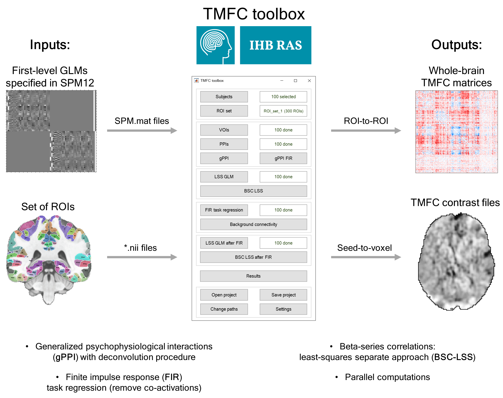
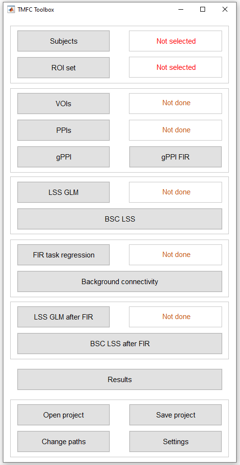
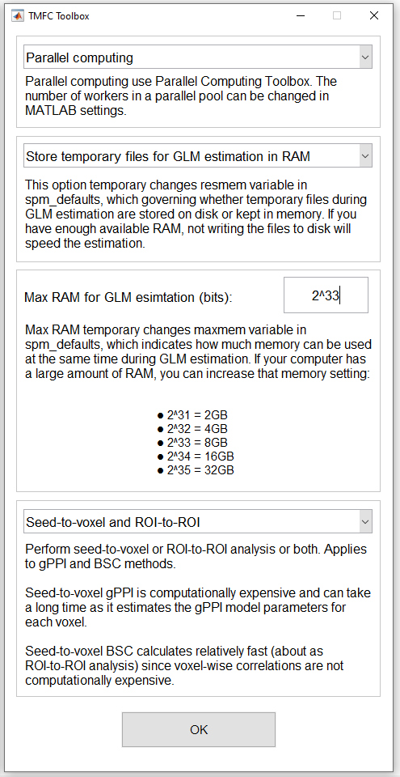
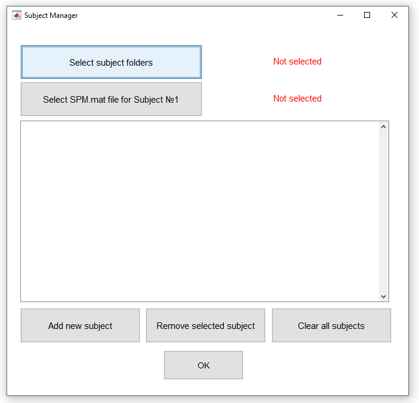
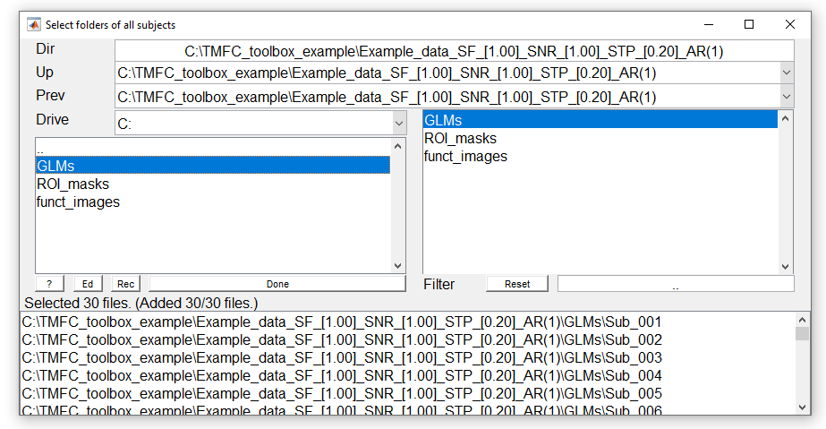
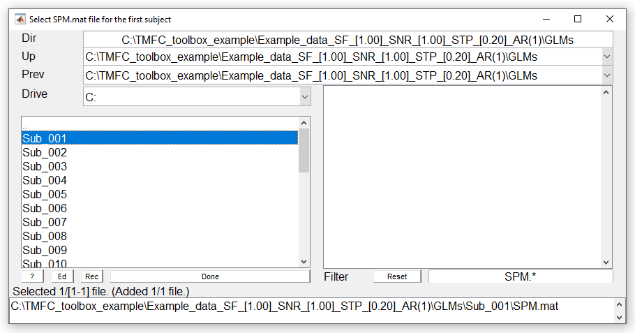
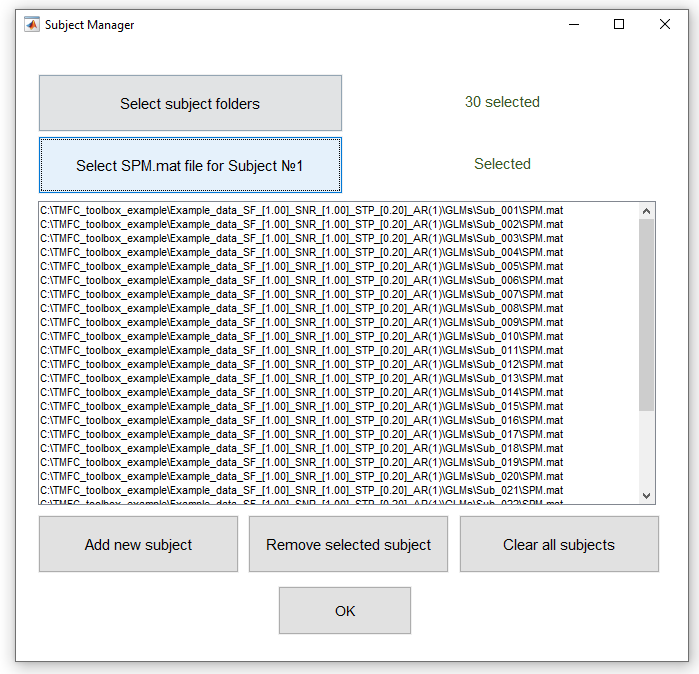
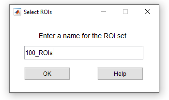
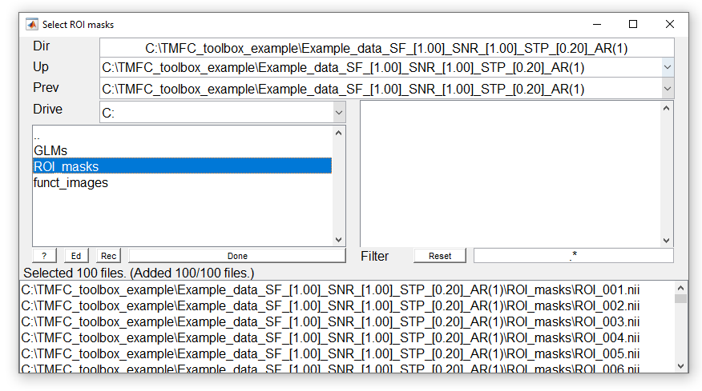
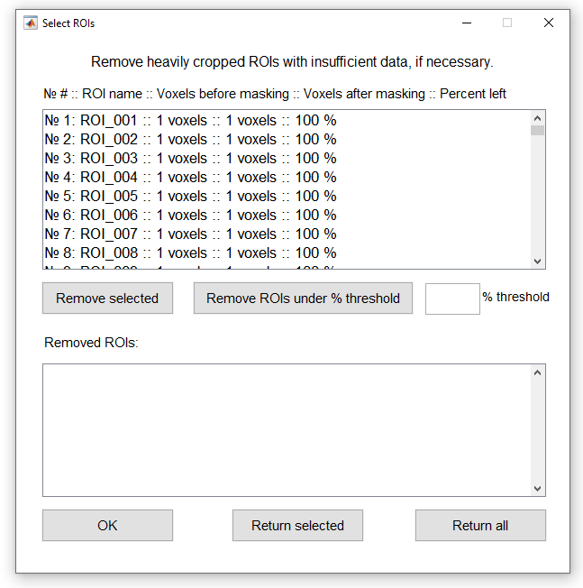

# Task-Modulated Functional Connectivity (TMFC) toolbox




-------------------------------------------------------------------------------------------

**TMFC** is a MATLAB toolbox for SPM12 for task-modulated functional connectivity analysis.

TMFC toolbox implements:
 - Beta-series correlations based on the least-squares separate appoach (**BSC-LSS**)
 - Generalized psyhophysiological interactions (**gPPI**) with deconvolution procedure
 - **Seed-to-voxel** analysis and **ROI-to-ROI** analysis (to create FC matrices)
 - Finite impulse response (**FIR**) task regression to remove co-activations
 - Graphical user interface (**GUI**) and command line interface (**CLI**)
 - RAM control (allows to estimate model parameters in the whole-brain at a time without dividing into chunks)
 - Parralel computations

If you use TMFC toolbox, please cite this study: <br/>
[Masharipov et al. "Comparison of whole-brain task-modulated functional connectivity methods for fMRI task connectomics." bioRxiv (2024): 2024-01](https://doi.org/10.1101/2024.01.22.576622).

## Installation

1) Add SPM12 to your MATLAB path (in case the user has not already done so);
2) Add TMFC toolbox to your MATLAB path (Home --> Set path --> Add with Subfolders --> Select TMFC_toolbox folder);
3) Enter **TMFC** in command window to open TMFC GUI <br/>
   or <br/>
4) See [TMFC_command_window_example.m](examples/TMFC_command_window_example.m) to run TMFC functions via command line

## Example data

To illustrate the use of TMFC toolbox, we provide simulated BOLD time series. Simulation was performed for 100 subjects and 100 ROIs. <br/>
Task design parameters:
- Event-related
- Two conditions (TaskA and TaskB)
- 40 events per condition
- Event duration = 1 s
- Random interstimulus interval (ISI) = 4-8 s (mean ISI = 6 s)
- Repetition time (TR) = 2 s
- Dummy scans: first 3 time points (6 s)
- Total scan time = 9.7 min

Simulation procedure is described in details in [the referenced paper](https://doi.org/10.1101/2024.01.22.576622) and here: <br/>
[https://github.com/IHB-IBR-department/TMFC_simulations](https://github.com/IHB-IBR-department/TMFC_simulations)

To prepare example data and estimate basic GLMs run this code:
```matlab

% BEFORE RUNNING THIS SCRIPT:
% 1) Set path to SPM12
% 2) Set path to TMFC_toolbox (Add with subfolders)
% 3) Change current working directory to: '...\TMFC_toolbox\examples'

%% Prepare example data and calculate basic first-level GLMs
clear
data.SF  = 1;         % Scaling Factor (SF) for co-activations: SF = SD_oscill/SD_coact
data.SNR = 1;         % Signal-to-noise ratio (SNR): SNR = SD_signal/SD_noise
data.STP_delay = 0.2; % Short-term synaptic plasticity (STP) delay, [s]
data.N = 30;          % Sample size (Select 30 subjects out of 100 to reduce computations)
data.N_ROIs = 100;    % Number of ROIs
data.dummy = 3;       % Remove first M dummy scans
data.TR = 2;          % Repetition time (TR), [s]
data.model = 'AR(1)'; % Autocorrelation modeling

% Set path for stat folder 
spm_jobman('initcfg');
data.stat_path = spm_select(1,'dir','Select a folder for data extraction and statistical analysis');

% Set path for simulated BOLD time series *.mat file
data.sim_path = fullfile(pwd,'data','SIMULATED_BOLD_EVENT_RELATED_[2s_TR]_[1s_DUR]_[6s_ISI]_[40_TRIALS].mat');

% Set path for task design *.mat file (stimulus onset times, SOTs)
data.sots_path = fullfile(pwd,'data','TASK_DESIGN_EVENT_RELATED_[2s_TR]_[1s_DUR]_[6s_ISI]_[40_TRIALS].mat');

% Generate *.nii images and calculate GLMs
prepare_example_data(data)

% Change current directory to new TMFC project folder
cd(data.stat_path)

```

This code creates *.nii files for 30 subjects (we select 30 subjects out of 100 to reduce computations).

Each *.nii file represents single time point and consists of 100 voxels. Each voxel correspons to one ROI. In this case, seed-to-voxel and ROI-to-ROI analyses are equivalent.

In real datasets, the number of voxels are not equal to the number of ROIs. However, all steps of TMFC analysis will be the same as described below.

## Example of TMFC GUI usage

### Main TMFC window

Enter **TMFC** in command window to open TMFC GUI:

<p align="center">

</p>

### Settings

Press **Settings** button to open settings window:

<p align="center">

</p>

* Choose between sequential and parallel computing (default: sequential computing)(change to parallel computing to speed up computations)
* Choose to store temporary files for GLM estimation on disk or in RAM (default: in RAM)
* Define Max RAM for GLM estimation (default: 2^32 = 4 GB)(change to 2^33 or 2^34 to speed up computations) 
* Choose to perform seed-to-voxel and/or ROI-to-ROI analysis (default: both)

Press OK

### Select subjects

Press **Subjects** button to open subject manager window:

<p align="center">

</p>

Press **Select subjects folder** button and select folders for 30 subjects (inside "...\Example_data_SF_[1.00] SNR_[1.00] STP_[0.20]_AR(1)\GLMs" folder):

<p align="center">

</p>

Press **Select SPM.mat file for Subject #1** and select SPM.mat for the first subject ("...\GLMs\Subject_001\SPM.mat"), which contains information about the basic first-level GLM (typical GLM used for activation analysis):

<p align="center">

</p>

Check selected subjects and press OK:

<p align="center">

</p>

### Select ROIs

Press **ROI_set** button and define ROI set name:

<p align="center">

</p>

Press OK and select 100 ROI masks (inside "...\Example_data_SF_[1.00] SNR_[1.00] STP_[0.20]_AR(1)\ROI_masks" folder):

<p align="center">

</p>

Check selected ROIs and press OK:

<p align="center">

</p>

In this example, single voxel represents a single ROI (i.e., ROI size = 1 voxel). In real data, each ROI will consist of several voxels. 
TMFC toolbox creates a "TMFC_project_folder\ROI_set_name\Masked_ROIs" folder, which contains:
* Group_mean.nii file - Group mean binary mask (identifies voxels that have data across all subjects)
* ROI_name_masked.nii files - ROI mask files masked by Group_mean.nii file (reduce original ROI mask to voxels that have data across all subjects)

ROI masks which do not contain any voxels that have data across all subjects will be removed from the TMFC analysis.
User can also remove heavily cropped ROIs.

## Change paths

## Example of TMFC usage from command line

Please see: <br/>
[TMFC_command_window_example.m](examples/TMFC_command_window_example.m) 

```matlab
clc
clear
close all

%% Set path for stat folder 

spm_jobman('initcfg');
data.stat_path = spm_select(1,'dir','Select a folder for data extraction and statistical analysis');


%% Setting up computation parameters

% Sequential or parallel computing (0 or 1)
tmfc.defaults.parallel = 1;         % Parallel
% Store temporaty files during GLM estimation in RAM or on disk
tmfc.defaults.resmem = true;        % RAM
% How much RAM can be used at the same time during GLM estimation
tmfc.defaults.maxmem = 2^33;        % 8 GB
% Seed-to-voxel and ROI-to-ROI analyses
tmfc.defaults.analysis = 1;


%% Setting up paths

% The path where all results will be saved
tmfc.project_path = data.stat_path;

% Define paths to individual subject SPM.mat files
% tmfc.subjects(1).path = '...\Your_study\Subjects\sub_001\stat\Standard_GLM\SPM.mat';
% tmfc.subjects(2).path = '...\Your_study\Subjects\sub_002\stat\Standard_GLM\SPM.mat';
% tmfc.subjects(3).path = '...\Your_study\Subjects\sub_003\stat\Standard_GLM\SPM.mat';
% etc

% Alternativelly, use tmfc_select_subjects_GUI to select subjects
SPM_check = 1;                      % Check SPM.mat files
[paths] = tmfc_select_subjects_GUI(SPM_check);

for i = 1:length(paths)
    tmfc.subjects(i).path = paths{i};
end


%% Select ROIs

% Use tmfc_select_ROIs_GUI to select ROIs
%
% The tmfc_select_ROIs_GUI function creates group binary mask based on
% 1st-level masks (SPM.VM) and applies it to all selected ROIs. Empty ROIs
% will be removed. Masked ROIs will be limited to only voxels which have 
% data for all subjects. The dimensions, orientation, and voxel sizes of 
% the masked ROI images will be adjusted according to the group binary mask

[ROI_set] = tmfc_select_ROIs_GUI(tmfc);
tmfc.ROI_set(1) = ROI_set;


%% LSS regression

% Define conditions of interest
% tmfc.LSS.conditions(1).sess   = 1;   
% tmfc.LSS.conditions(1).number = 1;
% tmfc.LSS.conditions(2).sess   = 1;
% tmfc.LSS.conditions(2).number = 2;

% Alternatively, use tmfc_LSS_GUI to select conditions of interest
[conditions] = tmfc_LSS_GUI(tmfc.subjects(1).path);
tmfc.LSS.conditions = conditions;

% Run LSS regression
start_sub = 1;                      % Start from the 1st subject
[sub_check] = tmfc_LSS(tmfc,start_sub);


%% BSC-LSS

% Extract and correlate mean beta series for conditions of interest
ROI_set_number = 1;                 % Select ROI set
[sub_check,contrasts] = tmfc_BSC(tmfc,ROI_set_number);

% Update contrasts info
% The tmfc_BSC function creates default contrasts for each
% condition of interest (i.e., Condition > Baseline)
tmfc.ROI_set(ROI_set_number).contrasts.BSC = contrasts;

% Define new contrasts:
tmfc.ROI_set(ROI_set_number).contrasts.BSC(3).title = 'TaskA_vs_TaskB';
tmfc.ROI_set(ROI_set_number).contrasts.BSC(4).title = 'TaskB_vs_TaskA';
tmfc.ROI_set(ROI_set_number).contrasts.BSC(3).weights = [1 -1];
tmfc.ROI_set(ROI_set_number).contrasts.BSC(4).weights = [-1 1];

% Calculate new contrasts
type = 3;                           % BSC-LSS
contrast_number = [3,4];            % Calculate contrasts #3 and #4
[sub_check] = tmfc_ROI_to_ROI_contrast(tmfc,type,contrast_number,ROI_set_number);
[sub_check] = tmfc_seed_to_voxel_contrast(tmfc,type,contrast_number,ROI_set_number);


%% FIR task regression (regress out co-activations and save residual time series)

% FIR window length in [s]
tmfc.FIR.window = 24;
% Nmber of FIR time bins
tmfc.FIR.bins = 24;

% Run FIR task regression
[sub_check] = tmfc_FIR(tmfc,start_sub);


%% LSS regression after FIR task regression (use residual time series)

% Define conditions of interest
[conditions] = tmfc_LSS_GUI(tmfc.subjects(1).path);
tmfc.LSS_after_FIR.conditions = conditions;

% Run LSS regression
[sub_check] = tmfc_LSS_after_FIR(tmfc,start_sub);


%% BSC-LSS after FIR task regression (use residual time series)

% Extract and correlate mean beta series for conditions of interest
ROI_set_number = 1;                 % Select ROI set
[sub_check,contrasts] = tmfc_BSC_after_FIR(tmfc,ROI_set_number);

% Update contrasts info
tmfc.ROI_set(ROI_set_number).contrasts.BSC_after_FIR = contrasts;

% Define new contrast:
tmfc.ROI_set(ROI_set_number).contrasts.BSC_after_FIR(3).title = 'TaskA_vs_TaskB';
tmfc.ROI_set(ROI_set_number).contrasts.BSC_after_FIR(4).title = 'TaskB_vs_TaskA';
tmfc.ROI_set(ROI_set_number).contrasts.BSC_after_FIR(3).weights = [1 -1];
tmfc.ROI_set(ROI_set_number).contrasts.BSC_after_FIR(4).weights = [-1 1];

% Calculate new contrast
type = 4;                           % BSC-LSS after FIR
contrast_number = [3,4];                % Calculate contrast #2
[sub_check] = tmfc_ROI_to_ROI_contrast(tmfc,type,contrast_number,ROI_set_number);
[sub_check] = tmfc_seed_to_voxel_contrast(tmfc,type,contrast_number,ROI_set_number);


%% BGFC

% Calculate background functional connectivity (BGFC)
[sub_check] = tmfc_BGFC(tmfc,ROI_set_number,start_sub);
```
