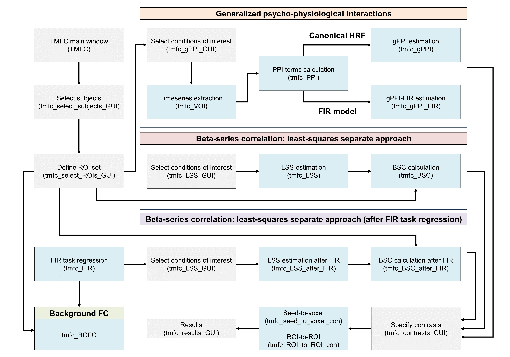

# Task-Modulated Functional Connectivity (TMFC) toolbox


-------------------------------------------------------------------------------------------

**TMFC** is a MATLAB toolbox for SPM12 for task-modulated functional connectivity analysis.

TMFC toolbox implements:
 - Beta-series correlations based on the least-squares separate appoach (**BSC-LSS**);
 - Generalized psyhophysiological interactions (**gPPI**) with deconvolution procedure;
 - **Seed-to-voxel** analysis and **ROI-to-ROI** analysis (to create FC matrices);
 - Finite impulse response (**FIR**) task regression to remove co-activations;
 - Graphical user interface (**GUI**) and command line interface (**CLI**);
 - RAM control (allows to estimate model parameters in the whole-brain at a time without dividing into chunks);
 - Parralel computations.

If you use TMFC toolbox, please cite this study: <br/>
[Masharipov et al. "Comparison of whole-brain task-modulated functional connectivity methods for fMRI task connectomics." bioRxiv (2024): 2024-01](https://doi.org/10.1101/2024.01.22.576622).

## Installation

1) Add SPM12 to your MATLAB path (in case the user has not already done so);
2) Add TMFC toolbox to your MATLAB path (Home --> Set path --> Add with Subfolders --> Select TMFC_toolbox folder);
3) Enter **TMFC** in command window to open TMFC GUI <br/>
   or <br/>
4) See [TMFC_command_window_example.m](examples/TMFC_command_window_example.m) to run TMFC functions via command line.

## Example data

To illustrate the use of TMFC toolbox, we provide simulated BOLD time series. Simulation was performed for 100 subjects and 100 ROIs. <br/>
Task design parameters:
- Event-related
- Two conditions (TaskA and TaskB)
- 40 events per condition
- Event duration = 1 s
- Random interstimulus interval (ISI) = 4-8 s (mean ISI = 6 s)
- Repetition time (TR) = 2 s
- Dummy scans: first 3 time points (6 s)
- Total scan time = 9.7 min

Simulation procedure is described in details in [the referenced paper](https://doi.org/10.1101/2024.01.22.576622) and here: <br/>
[https://github.com/IHB-IBR-department/TMFC_simulations](https://github.com/IHB-IBR-department/TMFC_simulations)

To prepare example data and estimate basic GLMs run this code:
```matlab

% BEFORE RUNNING THIS SCRIPT:
% 1) Set path to SPM12
% 2) Set path to TMFC_toolbox (Add with subfolders)
% 3) Change current working directory to: '...\TMFC_toolbox\examples'

%% Prepare example data and calculate basic first-level GLMs
clear
data.SF  = 1;         % Scaling Factor (SF) for co-activations: SF = SD_oscill/SD_coact
data.SNR = 1;         % Signal-to-noise ratio (SNR): SNR = SD_signal/SD_noise
data.STP_delay = 0.2; % Short-term synaptic plasticity (STP) delay, [s]
data.N = 20;          % Sample size (Select 20 subjects out of 100 to reduce computations)
data.N_ROIs = 100;    % Number of ROIs
data.dummy = 3;       % Remove first M dummy scans
data.TR = 2;          % Repetition time (TR), [s]
data.model = 'AR(1)'; % Autocorrelation modeling

% Set path for stat folder 
spm_jobman('initcfg');
data.stat_path = spm_select(1,'dir','Select a folder for data extraction and statistical analysis');

% Set path for simulated BOLD time series *.mat file
data.sim_path = fullfile(pwd,'data','SIMULATED_BOLD_EVENT_RELATED_[2s_TR]_[1s_DUR]_[6s_ISI]_[40_TRIALS].mat');

% Set path for task design *.mat file (stimulus onset times, SOTs)
data.sots_path = fullfile(pwd,'data','TASK_DESIGN_EVENT_RELATED_[2s_TR]_[1s_DUR]_[6s_ISI]_[40_TRIALS].mat');

% Generate *.nii images and calculate GLMs
prepare_example_data(data)

% Change current directory to new TMFC project folder
cd(data.stat_path)

```

This code creates *.nii files for 20 subjects (we select 20 subjects out of 100 and consider high SNR = 1 to reduce the number of computations).

Each *.nii file represents single time point and consists of 100 voxels. Each voxel correspons to one ROI. In this case, seed-to-voxel and ROI-to-ROI analyses are equivalent.

In real datasets, the number of voxels are not equal to the number of ROIs. However, all steps of TMFC analysis will be the same as described below.

## Example of TMFC GUI usage

## Main TMFC window

Enter **TMFC** in command window to open TMFC GUI:

<p align="center">

</p>

## Settings

Click **Settings** button to open settings window:

<p align="center">

</p>

* Choose between sequential and parallel computing (default: sequential computing)(change to parallel computing to speed up computations);
* Choose to store temporary files for GLM estimation on disk or in RAM (default: in RAM);
* Define Max RAM for GLM estimation (default: 2^32 = 4 GB)(change to 2^33 or 2^34 to speed up computations);
* Choose to perform seed-to-voxel and/or ROI-to-ROI analysis (default: both).

Click OK.

## Overview of TMFC functions 

<p align="center">

</p>

See how to use TMFC functions via command line [here](#Example-of-TMFC-usage-from-command-line).

## Folder structure

TMFC toolbox has the following folder structure:

<p align="center">

</p>

These folders and files will be created in the selected project path after performing corresponding analyses. To select TMFC project path and subjects click **Subjects** button.

## Select subjects

Click **Subjects** button to open subject manager window:

<p align="center">

</p>

Click **Select subjects folder** button and select folders for 20 subjects (inside "...\Example_data_SF_[1.00] SNR_[1.00] STP_[0.20]_AR(1)\GLMs" folder):

<p align="center">

</p>

Click **Select SPM.mat file for Subject #1** and select SPM.mat for the first subject ("...\GLMs\Subject_001\SPM.mat"), which contains information about the basic first-level GLM (typical GLM used for activation analysis):

<p align="center">

</p>

Check selected subjects and click OK:

<p align="center">

</p>

Finally, **select a folder for the new TMFC project**.

## Select ROIs

Click **ROI_set** button and define ROI set name:

<p align="center">

</p>

Click OK and select 100 ROI masks (inside "...\Example_data_SF_[1.00] SNR_[1.00] STP_[0.20]_AR(1)\ROI_masks" folder):

<p align="center">

</p>

Check selected ROIs and click OK:

<p align="center">

</p>

In this example, single voxel represents a single ROI (i.e., ROI size = 1 voxel). In real data, each ROI will consist of several voxels. 
TMFC toolbox creates a **"TMFC_project_folder\ROI_sets\ROI_set_name\Masked_ROIs"** folder, which contains:
* Group_mean.nii file - Group mean binary mask (identifies voxels that have data across all subjects)
* ROI_name_masked.nii files - ROI mask files masked by Group_mean.nii file (reduce original ROI mask to voxels that have data across all subjects)

ROI masks which do not contain any voxels that have data across all subjects will be removed from the TMFC analysis.
User can also remove heavily cropped ROIs.

You can define several ROI sets and switch between them. For example, push **ROI_set** button a second time and then push "Add new ROI set":

<p align="center">

</p>

Define a name for the second ROI set (e.g., "20_ROIs) and select ROI masks for the second ROI set (e.g., select 20 ROIs). Now you can switch between ROI sets.

Click **ROI_set** button a third time and select "100_ROIs" set:

<p align="center">

</p>

## Least-squares separate (LSS) regression 

To perfrom beta-series correlation (BSC) analysis, we first need to calculate parameter estimates (betas) for individual trials using LSS regression.

Click **LSS GLM** button and select conditions of interest (individual betas will be calculated only for the selected conditions):

<p align="center">

</p>

Once the calculations are complete, TMFC toolbox will create a **"...\TMFC_project_name\LSS_regression"** folder with subfolders for each subject. Subjects' subfolders will contain **trial-wise beta images** and **SPM12 batches for individual trial GLMs**. 

## Beta-series correlaction based on LSS regression (BSC-LSS)

To perform BSC-LSS analysis for selected ROI set, click **BSC LSS** button.

Once the calculations are complete, TMFC toolbox will create a **"...\TMFC_project_name\ROI_sets\ROI_set_name\BSC_LSS"** folder with three subfolders:
* **Beta_series** - containes beta series extracted for the selected ROI set (beta parameters are averaged across voxels for each ROI mask);
* **ROI_to_ROI**  - containes **BSC-LSS functional connectivity matrices** (Person's r converted to Fisher's Z);
* **Seed_to_voxel** - containes **voxel-by-voxel BSC-LSS images** (*.nii files containing Fisher's Z values) calculated for each seed ROI.

**NOTE:** You don't need to recalculare LSS regression to perform the BSC-LSS analysis for a different ROI set. Just select a different ROI set by clicking the **ROI set** button and then click the **BSC-LSS** button.

## BSC-LSS results

By default, TMFC calculates contrasts for each condition of interest (Condition > Baseline). To calculate the functional connectivity difference between conditions (i.e., "Condition A > Condition B") click the **BSC LSS** button once again:

<p align="center">

</p>

Define a new contrast by pressing "Add new" button, enter contrast title ("TaskA_vs_TaskB") and specify contrast weights ([1 -1]), and click OK:

<p align="center">

</p>

Click OK to calculate the new contrast. Each time you need to calculate a new contrast, click the **BSC LSS** button. Contrast files will be stored in **ROI_to_ROI** and **Seed_to_voxel** subfolders.

### Seed-to-voxel results

You can use the SPM12 software to perform voxel-wise statistical inference. Click "Specify 2nd-level" button, select "One-sample t-test" and specify 20 contrast files for the "Cond_A_vs_Cond_B" contrast and the selected seed ROI from the **...\Seed_to_voxel\ROI_name** subfolder.

### ROI-to-ROI results

In future releases, we will add a GUI window to perform ROI-to-ROI statistical inference. It will implement edge-wise FDR and Bonferroni correction, as well as network-based statistics (NBS) and threshold-free cluster enhancement (TFCE) with network-level FWE correction.

TMFC matrices (*.mat files) can be analysed in any MATLAB toolbox for ROI-to-ROI statistical inference. For example, you can use the network-based statistics (NBS) toolbox (https://www.nitrc.org/projects/nbs/). 

To visualisaze the ROI-to-ROI results, enter this code in MATLAB command window:

```matlab
% Select TMFC project path
tmfc.project_path = spm_select(1,'dir','Select TMFC project folder');

% Load BSC-LSS matrices for the 'TaskA_vs_TaskB' contrast (contrast # 3)
for i = 1:data.N 
    M(i).paths = struct2array(load(fullfile(tmfc.project_path,'ROI_sets',tmfc.ROI_set(ROI_set_number).set_name,'BSC_LSS','ROI_to_ROI',...
        ['Subject_' num2str(i,'%04.f') '_Contrast_0003_[TaskA_vs_TaskB].mat'])));
end
matrices = cat(3,M(:).paths);

% Perform one-sample t-test (two-sided, FDR-correction) 
contrast = 1;                       % TaskA_vs_TaskB effect
alpha = 0.001/2;                    % alpha = 0.001 thredhold corrected for two-sided comparison
correction = 'FDR';                 % False Discovery Rate (FDR) correction (Benjamini–Hochberg procedure)
[thresholded,pval,tval,conval] = tmfc_ttest(matrices,contrast,alpha,correction); 

% Plot BSC-LSS results
figure(1);
sgtitle('BSC-LSS results');
subplot(1,2,1); imagesc(conval);        subtitle('Group mean'); axis square; colorbar; caxis(tmfc_axis(conval,1));
subplot(1,2,2); imagesc(thresholded);   subtitle('pFDR<0.001'); axis square; colorbar;
colormap(subplot(1,2,1),'redblue')
set(findall(gcf,'-property','FontSize'),'FontSize',16)

```

Results for edge-wise inference with FDR-correction ("TaskA > TaskB" contrast):

<p align="center">

</p>

## BSC-LSS after FIR task regression

Co-activations can spuriosly inflate TMFC estimates (see [the referenced paper](https://doi.org/10.1101/2024.01.22.576622) and [Cole et al., 2019](https://doi.org/10.1016/j.neuroimage.2018.12.054)).

To remove co-activations, we can perform task regression with finite impulse response (FIR) functions prior to BSC analysis.

Click **"FIR task regression"** button and specify FIR window length and the number of FIR time bins:

<p align="center">

</p>

Click OK. Once the calculations are complete, TMFC toolbox will create a **"...\TMFC_project_name\FIR_regression"** folder with subjects' subfolders. Subjects' subfolders will contain **residuals (*.nii images)**, as well as **SPM12 batches and SPM.mat files for FIR GLMs**. 

To perform BSC-LSS analysis after FIR task regression (using residual time series), click **BSC LSS after FIR** button. The following steps are similar to those for the BSC-LSS analysis.

## Generalized psyhophysiological interactions (gPPI)

To perform gPPI analysis, we first need to extract time series from the seed ROIs and calculate psyhophysiological interaction (PPI) terms.

### Volume of interest (VOI) 

Click **"VOIs"** button to extract time series for the selected ROI set. Select conditions of interest. All other conditions will be considered as nuisance conditions. TMFC toolbox uses SPM12 volume of interest (VOI) function to extract time series. It extracts the first eigenvariate for the seed ROI after removing effects of no interest (using nuisance regressors, such as motion regressors, aCompCorr regressors, regressors for conditions of no interest, etc), and performing whitening and high-pass filtering.

Once the calculations are complete, TMFC toolbox will create a **"...\TMFC_project_name\ROI_sets\ROI_set_name\VOIs"** folder with subjects' subfolders. Subjects' subfolders will contain SPM12 **VOI .mat files**.

### Psyhophysiological interaction (PPI) terms

Click **"PPIs"** button to calculate PPI terms using the deconvolution procedure ([Gitelman et al., 2003](https://doi.org/10.1016/S1053-8119(03)00058-2)). TMFC toolbox uses SPM12 Parametric Empirical Bayes (PEB) function to calulate PPI terms.

Once the calculations are complete, TMFC toolbox will create a **"...\TMFC_project_name\ROI_sets\ROI_set_name\PPIs"** folder with subjects' subfolders. Subjects' subfolders will contain SPM12 **PPI .mat files**.

### gPPI analysis

Click **"gPPI"** button to perform gPPI analysis. 

Once the calculations are complete, TMFC toolbox will create a **"...\TMFC_project_name\ROI_sets\ROI_set_name\gPPI"** folder with three subfolders:
* **GLM_batches** - containes SPM12 batches for gPPI GLMs;
* **ROI_to_ROI**  - containes **gPPI functional connectivity matrices** (asymmetrical and symmetrical, symmetrization is carried out by averaging the upper and lower diagonal elements);
* **Seed_to_voxel** - containes **voxel-by-voxel gPPI images** calculated for each seed ROI.

## gPPI-FIR analysis

To remove co-activations with arbitrary shape of HRF function, we can combine FIR task regression with gPPI regression. The difference between classic gPPI GLM and gPPI-FIR GLM is that the
latter uses finite impulse response (FIR) functions (instead of canonical HRF function) to model activations for conditions of interst and conditions of no interest. The FIR model allows to model activations with any possible hemodynamic response shape.

Click **"gPPI-FIR"** button to perform gPPI-FIR analysis. 

Once the calculations are complete, TMFC toolbox will create a **"...\TMFC_project_name\ROI_sets\ROI_set_name\gPPI-FIR"** folder with three subfolders (GLM_batches, ROI_to_ROI, Seed_to_voxel).

### gPPI-FIR results

To visualisaze the ROI-to-ROI results, enter this code in MATLAB command window:
```matlab
% Select TMFC project path
tmfc.project_path = spm_select(1,'dir','Select TMFC project folder');

% Load gPPI-FIR matrices for the 'TaskA_vs_TaskB' contrast (contrast # 3)
for i = 1:data.N 
    M(i).paths = struct2array(load(fullfile(tmfc.project_path,'ROI_sets',tmfc.ROI_set(ROI_set_number).set_name,'gPPI_FIR','ROI_to_ROI','symmetrical',...
        ['Subject_' num2str(i,'%04.f') '_Contrast_0003_[TaskA_vs_TaskB].mat'])));
end
matrices = cat(3,M(:).paths);

% Perform one-sample t-test (two-sided, FDR-correction) 
contrast = 1;                       % TaskA_vs_TaskB effect
alpha = 0.001/2;                    % alpha = 0.001 thredhold corrected for two-sided comparison
correction = 'FDR';                 % False Discovery Rate (FDR) correction (Benjamini–Hochberg procedure)
[thresholded,pval,tval,conval] = tmfc_ttest(matrices,contrast,alpha,correction); 

% Plot gPPI-FIR results
figure(2);
sgtitle('gPPI-FIR results');
subplot(1,2,1); imagesc(conval);        subtitle('Group mean'); axis square; colorbar; caxis(tmfc_axis(conval,1));
subplot(1,2,2); imagesc(thresholded);   subtitle('pFDR<0.001'); axis square; colorbar;
colormap(subplot(1,2,1),'redblue')
set(findall(gcf,'-property','FontSize'),'FontSize',16)

```

Results for edge-wise inference with FDR-correction ("TaskA > TaskB" contrast):

<p align="center">

</p>

## Change paths

## Example of TMFC usage from command line

Please see: <br/>
[TMFC_command_window_example.m](examples/TMFC_command_window_example.m) 

```matlab
clc
clear
close all

%% Set path for stat folder 

spm_jobman('initcfg');
data.stat_path = spm_select(1,'dir','Select a folder for data extraction and statistical analysis');


%% Setting up computation parameters

% Sequential or parallel computing (0 or 1)
tmfc.defaults.parallel = 1;         % Parallel
% Store temporaty files during GLM estimation in RAM or on disk
tmfc.defaults.resmem = true;        % RAM
% How much RAM can be used at the same time during GLM estimation
tmfc.defaults.maxmem = 2^33;        % 8 GB
% Seed-to-voxel and ROI-to-ROI analyses
tmfc.defaults.analysis = 1;


%% Setting up paths

% The path where all results will be saved
tmfc.project_path = data.stat_path;

% Define paths to individual subject SPM.mat files
% tmfc.subjects(1).path = '...\Your_study\Subjects\sub_001\stat\Standard_GLM\SPM.mat';
% tmfc.subjects(2).path = '...\Your_study\Subjects\sub_002\stat\Standard_GLM\SPM.mat';
% tmfc.subjects(3).path = '...\Your_study\Subjects\sub_003\stat\Standard_GLM\SPM.mat';
% etc

% Alternativelly, use tmfc_select_subjects_GUI to select subjects
SPM_check = 1;                      % Check SPM.mat files
[paths] = tmfc_select_subjects_GUI(SPM_check);

for i = 1:length(paths)
    tmfc.subjects(i).path = paths{i};
end


%% Select ROIs

% Use tmfc_select_ROIs_GUI to select ROIs
%
% The tmfc_select_ROIs_GUI function creates group binary mask based on
% 1st-level masks (SPM.VM) and applies it to all selected ROIs. Empty ROIs
% will be removed. Masked ROIs will be limited to only voxels which have 
% data for all subjects. The dimensions, orientation, and voxel sizes of 
% the masked ROI images will be adjusted according to the group binary mask

[ROI_set] = tmfc_select_ROIs_GUI(tmfc);
tmfc.ROI_set(1) = ROI_set;


%% LSS regression

% Define conditions of interest
% tmfc.LSS.conditions(1).sess   = 1;   
% tmfc.LSS.conditions(1).number = 1;
% tmfc.LSS.conditions(2).sess   = 1;
% tmfc.LSS.conditions(2).number = 2;

% Alternatively, use tmfc_LSS_GUI to select conditions of interest
[conditions] = tmfc_LSS_GUI(tmfc.subjects(1).path);
tmfc.LSS.conditions = conditions;

% Run LSS regression
start_sub = 1;                      % Start from the 1st subject
[sub_check] = tmfc_LSS(tmfc,start_sub);


%% BSC-LSS

% Extract and correlate mean beta series for conditions of interest
ROI_set_number = 1;                 % Select ROI set
[sub_check,contrasts] = tmfc_BSC(tmfc,ROI_set_number);

% Update contrasts info
% The tmfc_BSC function creates default contrasts for each
% condition of interest (i.e., Condition > Baseline)
tmfc.ROI_set(ROI_set_number).contrasts.BSC = contrasts;

% Define new contrasts:
tmfc.ROI_set(ROI_set_number).contrasts.BSC(3).title = 'TaskA_vs_TaskB';
tmfc.ROI_set(ROI_set_number).contrasts.BSC(4).title = 'TaskB_vs_TaskA';
tmfc.ROI_set(ROI_set_number).contrasts.BSC(3).weights = [1 -1];
tmfc.ROI_set(ROI_set_number).contrasts.BSC(4).weights = [-1 1];

% Calculate new contrasts
type = 3;                           % BSC-LSS
contrast_number = [3,4];            % Calculate contrasts #3 and #4
[sub_check] = tmfc_ROI_to_ROI_contrast(tmfc,type,contrast_number,ROI_set_number);
[sub_check] = tmfc_seed_to_voxel_contrast(tmfc,type,contrast_number,ROI_set_number);

% Load BSC-LSS matrices for the 'TaskA_vs_TaskB' contrast (contrast # 3)
for i = 1:data.N 
    M(i).paths = struct2array(load(fullfile(tmfc.project_path,'ROI_sets',tmfc.ROI_set(ROI_set_number).set_name,'BSC_LSS','ROI_to_ROI',...
        ['Subject_' num2str(i,'%04.f') '_Contrast_0003_[TaskA_vs_TaskB].mat'])));
end
matrices = cat(3,M(:).paths);

% Perform one-sample t-test (two-sided, FDR-correction) 
contrast = 1;                       % TaskA_vs_TaskB effect
alpha = 0.001/2;                    % alpha = 0.001 thredhold corrected for two-sided comparison
correction = 'FDR';                 % False Discovery Rate (FDR) correction (Benjamini–Hochberg procedure)
[thresholded,pval,tval,conval] = tmfc_ttest(matrices,contrast,alpha,correction); 

% Plot BSC-LSS results
figure(1);
sgtitle('BSC-LSS results');
subplot(1,2,1); imagesc(conval);        subtitle('Group mean'); axis square; colorbar; caxis(tmfc_axis(conval,1));
subplot(1,2,2); imagesc(thresholded);   subtitle('pFDR<0.001'); axis square; colorbar;
colormap(subplot(1,2,1),'redblue')
set(findall(gcf,'-property','FontSize'),'FontSize',16)


%% FIR task regression (regress out co-activations and save residual time series)

% FIR window length in [s]
tmfc.FIR.window = 24;
% Number of FIR time bins
tmfc.FIR.bins = 24;

% Run FIR task regression
[sub_check] = tmfc_FIR(tmfc,start_sub);


%% LSS regression after FIR task regression (use residual time series)

% Define conditions of interest
tmfc.LSS_after_FIR.conditions = tmfc.LSS.conditions;

% Run LSS regression
[sub_check] = tmfc_LSS_after_FIR(tmfc,start_sub);


%% BSC-LSS after FIR task regression (use residual time series)

% Extract and correlate mean beta series for conditions of interest
ROI_set_number = 1;                 % Select ROI set
[sub_check,contrasts] = tmfc_BSC_after_FIR(tmfc,ROI_set_number);

% Update contrasts info
% The tmfc_BSC_after_FIR function creates default contrasts for each
% condition of interest (i.e., Condition > Baseline)
tmfc.ROI_set(ROI_set_number).contrasts.BSC_after_FIR = contrasts;

% Define new contrast:
tmfc.ROI_set(ROI_set_number).contrasts.BSC_after_FIR(3).title = 'TaskA_vs_TaskB';
tmfc.ROI_set(ROI_set_number).contrasts.BSC_after_FIR(4).title = 'TaskB_vs_TaskA';
tmfc.ROI_set(ROI_set_number).contrasts.BSC_after_FIR(3).weights = [1 -1];
tmfc.ROI_set(ROI_set_number).contrasts.BSC_after_FIR(4).weights = [-1 1];

% Calculate new contrast
type = 4;                           % BSC-LSS after FIR
contrast_number = [3,4];            % Calculate contrast #3 and #4
[sub_check] = tmfc_ROI_to_ROI_contrast(tmfc,type,contrast_number,ROI_set_number);
[sub_check] = tmfc_seed_to_voxel_contrast(tmfc,type,contrast_number,ROI_set_number);

% Load BSC-LSS (after FIR) matrices for the 'TaskA_vs_TaskB' contrast (contrast # 3)
clear M marices conval thresholded
for i = 1:data.N 
    M(i).paths = struct2array(load(fullfile(tmfc.project_path,'ROI_sets',tmfc.ROI_set(ROI_set_number).set_name,'BSC_LSS_after_FIR','ROI_to_ROI',...
        ['Subject_' num2str(i,'%04.f') '_Contrast_0003_[TaskA_vs_TaskB].mat'])));
end
matrices = cat(3,M(:).paths);

% Perform one-sample t-test (two-sided, FDR-correction) 
[thresholded,pval,tval,conval] = tmfc_ttest(matrices,contrast,alpha,correction); 

% Plot BSC-LSS (after FIR) results
figure(2);
sgtitle('BSC-LSS (after FIR task regression) results');
subplot(1,2,1); imagesc(conval);        subtitle('Group mean'); axis square; colorbar; caxis(tmfc_axis(conval,1));
subplot(1,2,2); imagesc(thresholded);   subtitle('pFDR<0.001'); axis square; colorbar;
colormap(subplot(1,2,1),'redblue')
set(findall(gcf,'-property','FontSize'),'FontSize',16)


%% BGFC

% Calculate background functional connectivity (BGFC)
[sub_check] = tmfc_BGFC(tmfc,ROI_set_number,start_sub);


%% gPPI

% Define conditions of interest
tmfc.ROI_set(ROI_set_number).gPPI.conditions = tmfc.LSS.conditions;

% VOI extraction
[sub_check] = tmfc_VOI(tmfc,ROI_set_number,start_sub);

% PPI calculation
[sub_check] = tmfc_PPI(tmfc,ROI_set_number,start_sub);

% gPPI calculation
[sub_check,contrasts] = tmfc_gPPI(tmfc,ROI_set_number,start_sub);

% Update contrasts info
% The tmfc_gPPI function creates default contrasts for each
% condition of interest (i.e., Condition > Baseline)
tmfc.ROI_set(ROI_set_number).contrasts.gPPI = contrasts;

% Define new contrasts:
tmfc.ROI_set(ROI_set_number).contrasts.gPPI(3).title = 'TaskA_vs_TaskB';
tmfc.ROI_set(ROI_set_number).contrasts.gPPI(4).title = 'TaskB_vs_TaskA';
tmfc.ROI_set(ROI_set_number).contrasts.gPPI(3).weights = [1 -1];
tmfc.ROI_set(ROI_set_number).contrasts.gPPI(4).weights = [-1 1];

% Calculate new contrasts
type = 1;                           % gPPI
contrast_number = [3,4];            % Calculate contrasts #3 and #4
[sub_check] = tmfc_ROI_to_ROI_contrast(tmfc,type,contrast_number,ROI_set_number);
[sub_check] = tmfc_seed_to_voxel_contrast(tmfc,type,contrast_number,ROI_set_number);

% Load gPPI matrices for the 'TaskA_vs_TaskB' contrast (contrast # 3)
clear M marices conval thresholded
for i = 1:data.N 
    M(i).paths = struct2array(load(fullfile(tmfc.project_path,'ROI_sets',tmfc.ROI_set(ROI_set_number).set_name,'gPPI','ROI_to_ROI','symmetrical',...
        ['Subject_' num2str(i,'%04.f') '_Contrast_0003_[TaskA_vs_TaskB].mat'])));
end
matrices = cat(3,M(:).paths);

% Perform one-sample t-test (two-sided, FDR-correction) 
[thresholded,pval,tval,conval] = tmfc_ttest(matrices,contrast,alpha,correction); 

% Plot gPPI results
figure(3);
sgtitle('gPPI results');
subplot(1,2,1); imagesc(conval);        subtitle('Group mean'); axis square; colorbar; caxis(tmfc_axis(conval,1));
subplot(1,2,2); imagesc(thresholded);   subtitle('pFDR<0.001'); axis square; colorbar;
colormap(subplot(1,2,1),'redblue')
set(findall(gcf,'-property','FontSize'),'FontSize',16)


%% gPPI-FIR (gPPI model with psychological regressors defined by FIR functions)

% Define FIR parameters for gPPI-FIR
tmfc.ROI_set(ROI_set_number).gPPI_FIR.window = 24;   % FIR window length in [s]
tmfc.ROI_set(ROI_set_number).gPPI_FIR.bins = 24;     % Number of FIR time bins

% gPPI-FIR calculation
[sub_check,contrasts] = tmfc_gPPI_FIR(tmfc,ROI_set_number,start_sub);

% Update contrasts info
% The tmfc_gPPI_FIR function creates default contrasts for each
% condition of interest (i.e., Condition > Baseline)
tmfc.ROI_set(ROI_set_number).contrasts.gPPI_FIR = contrasts;

% Define new contrasts:
tmfc.ROI_set(ROI_set_number).contrasts.gPPI_FIR(3).title = 'TaskA_vs_TaskB';
tmfc.ROI_set(ROI_set_number).contrasts.gPPI_FIR(4).title = 'TaskB_vs_TaskA';
tmfc.ROI_set(ROI_set_number).contrasts.gPPI_FIR(3).weights = [1 -1];
tmfc.ROI_set(ROI_set_number).contrasts.gPPI_FIR(4).weights = [-1 1];

% Calculate new contrasts
type = 2;                           % gPPI-FIR
contrast_number = [3,4];            % Calculate contrasts #3 and #4
[sub_check] = tmfc_ROI_to_ROI_contrast(tmfc,type,contrast_number,ROI_set_number);
[sub_check] = tmfc_seed_to_voxel_contrast(tmfc,type,contrast_number,ROI_set_number);

% Load gPPI-FIR matrices for the 'TaskA_vs_TaskB' contrast (contrast # 3)
clear M marices conval thresholded
for i = 1:data.N 
    M(i).paths = struct2array(load(fullfile(tmfc.project_path,'ROI_sets',tmfc.ROI_set(ROI_set_number).set_name,'gPPI_FIR','ROI_to_ROI','symmetrical',...
        ['Subject_' num2str(i,'%04.f') '_Contrast_0003_[TaskA_vs_TaskB].mat'])));
end
matrices = cat(3,M(:).paths);

% Perform one-sample t-test (two-sided, FDR-correction) 
[thresholded,pval,tval,conval] = tmfc_ttest(matrices,contrast,alpha,correction); 

% Plot gPPI-FIR results
figure(4);
sgtitle('gPPI-FIR results');
subplot(1,2,1); imagesc(conval);        subtitle('Group mean'); axis square; colorbar; caxis(tmfc_axis(conval,1));
subplot(1,2,2); imagesc(thresholded);   subtitle('pFDR<0.001'); axis square; colorbar;
colormap(subplot(1,2,1),'redblue')
set(findall(gcf,'-property','FontSize'),'FontSize',16)
```
